# QuizQuarry 🪨

> **AI-driven question bank & proctored quiz platform** — powered by Google Gemini, built with Spring Boot and React.

QuizQuarry lets instructors spin up intelligent, auto-generated quizzes from any topic in seconds and gives students a focused, proctored assessment experience — complete with answer explanations, score history, and a live global leaderboard.

---

## 📸 Screenshots

### Authentication

<table>
  <tr>
    <td>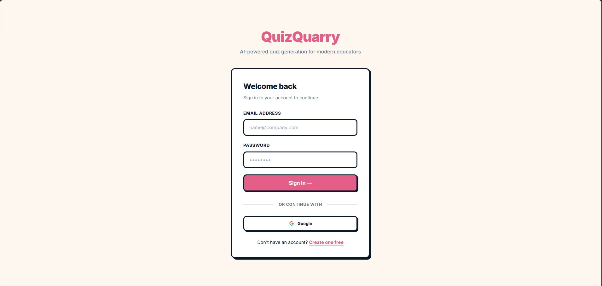<br/><sub><b>Login — email/password or Google OAuth</b></sub></td>
    <td>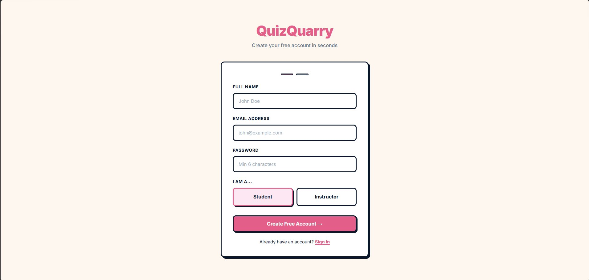<br/><sub><b>Register — choose Student or Instructor role</b></sub></td>
    <td>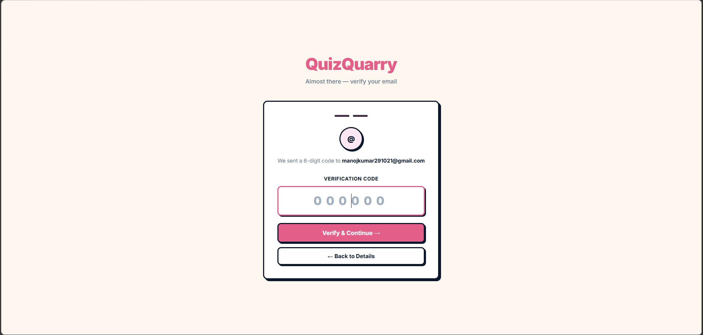<br/><sub><b>Email OTP verification</b></sub></td>
  </tr>
</table>

### Instructor — Quiz Management

<table>
  <tr>
    <td>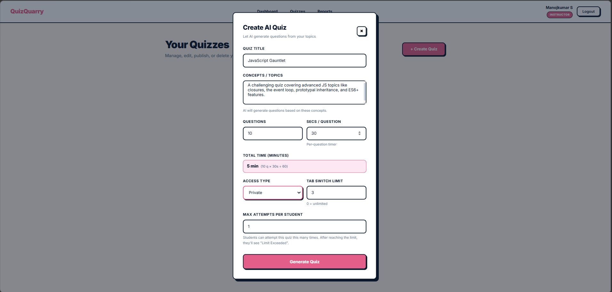<br/><sub><b>Create AI Quiz — enter topic, set time &amp; access rules</b></sub></td>
    <td>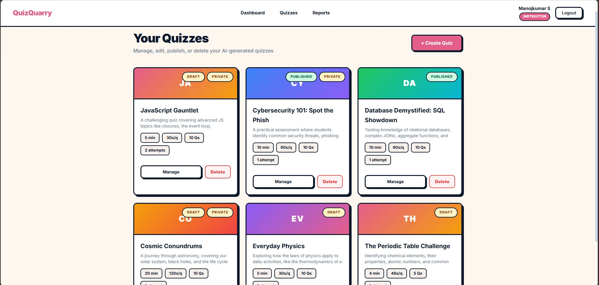<br/><sub><b>Quiz list — manage draft &amp; published quizzes</b></sub></td>
  </tr>
</table>

### Instructor — Quiz Editor

<table>
  <tr>
    <td>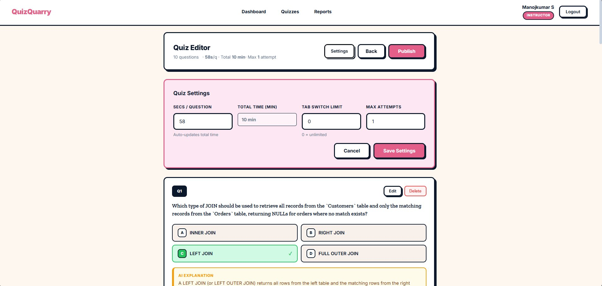<br/><sub><b>Quiz Editor — adjust settings and review questions</b></sub></td>
    <td>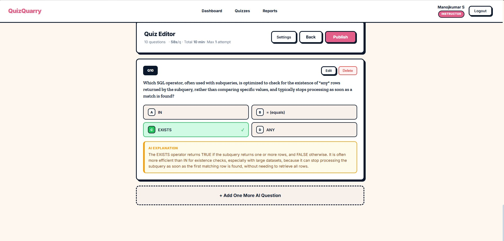<br/><sub><b>AI-generated questions with explanations — edit or delete</b></sub></td>
    <td>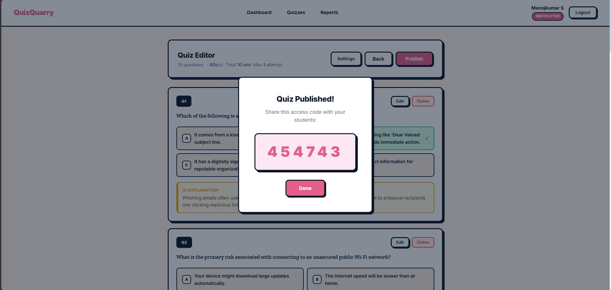<br/><sub><b>Publish quiz — access code generated for private quizzes</b></sub></td>
  </tr>
</table>

### Student — Taking a Quiz

<table>
  <tr>
    <td>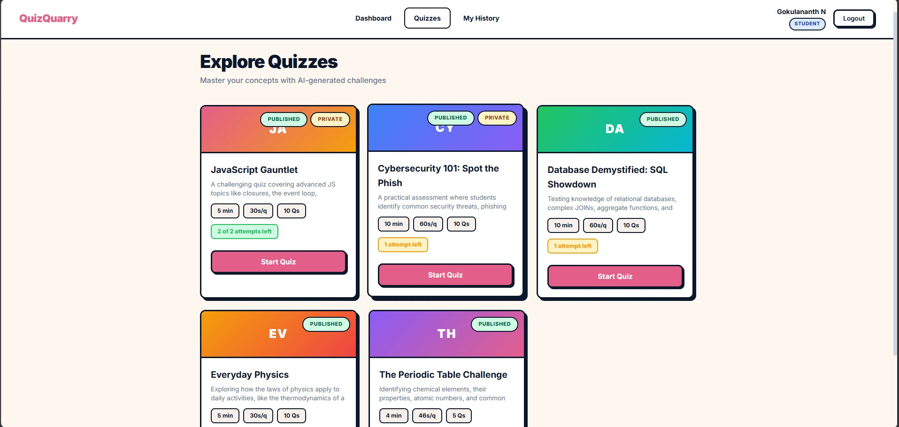<br/><sub><b>Explore quizzes — attempts remaining shown per quiz</b></sub></td>
    <td>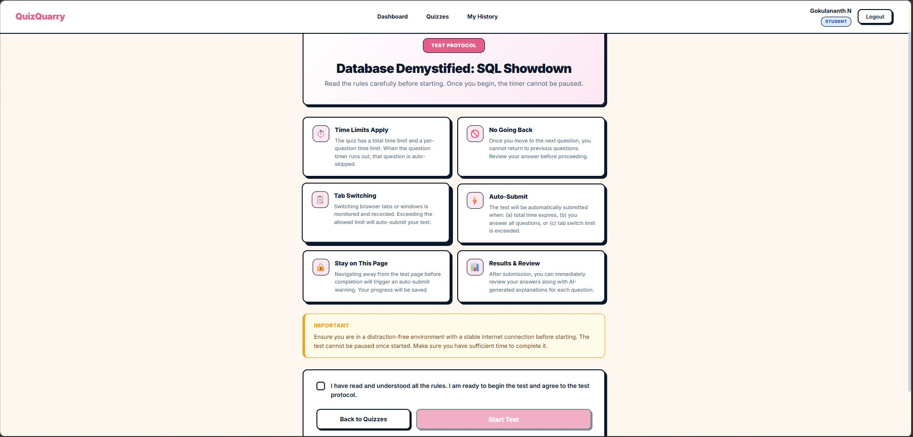<br/><sub><b>Test Protocol — rules screen before the quiz begins</b></sub></td>
    <td>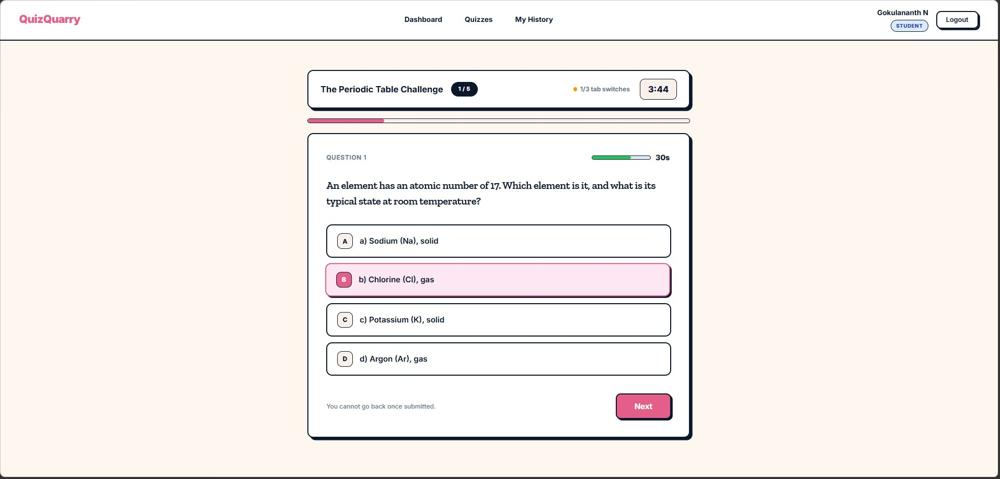<br/><sub><b>Live quiz — per-question timer, tab-switch counter, progress bar</b></sub></td>
  </tr>
</table>

### Student — Results & History

<table>
  <tr>
    <td>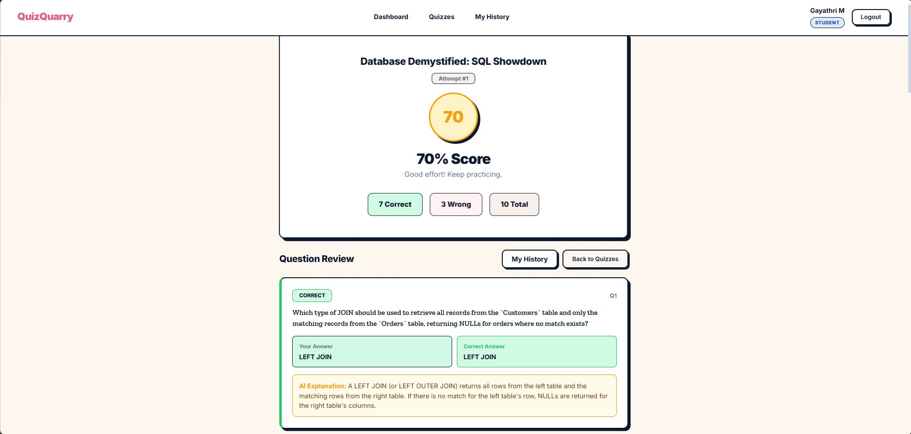<br/><sub><b>Result — score, correct/wrong, AI explanation per question</b></sub></td>
    <td>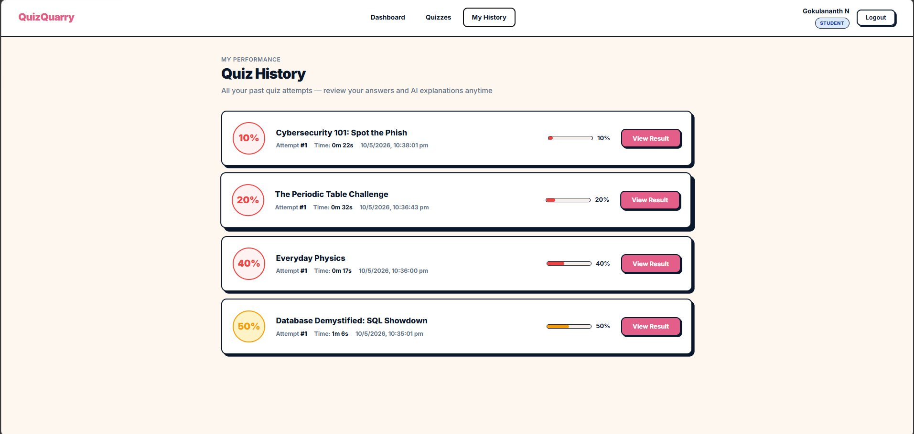<br/><sub><b>My History — all past attempts with scores and timestamps</b></sub></td>
  </tr>
</table>

### Dashboards

<table>
  <tr>
    <td>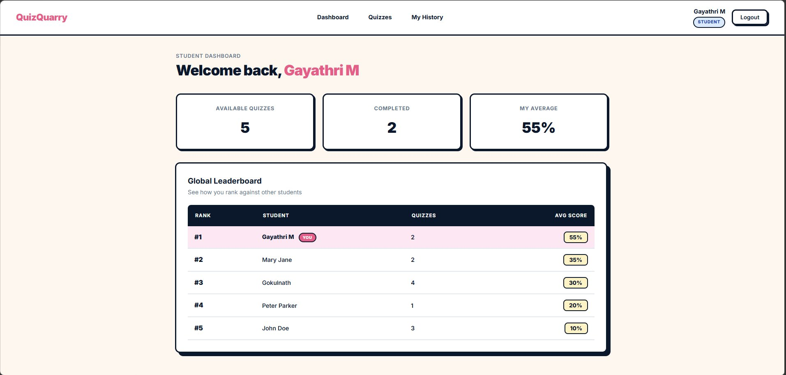<br/><sub><b>Student Dashboard — stats &amp; global leaderboard</b></sub></td>
    <td>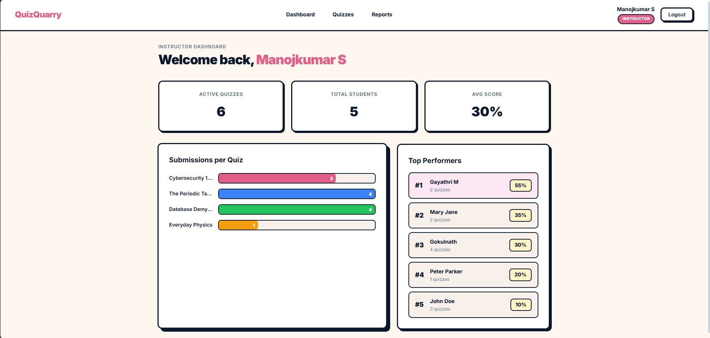<br/><sub><b>Instructor Dashboard — submissions chart &amp; top performers</b></sub></td>
  </tr>
</table>

### Instructor — Reports

<table>
  <tr>
    <td>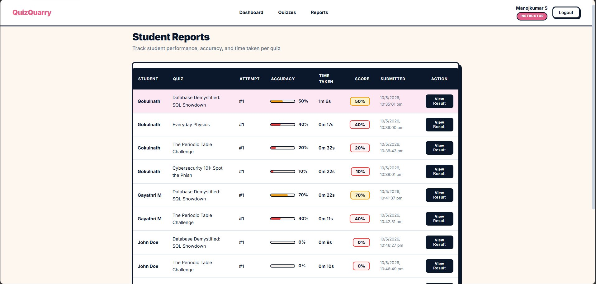<br/><sub><b>Student Reports — accuracy, time taken, score per attempt</b></sub></td>
    <td>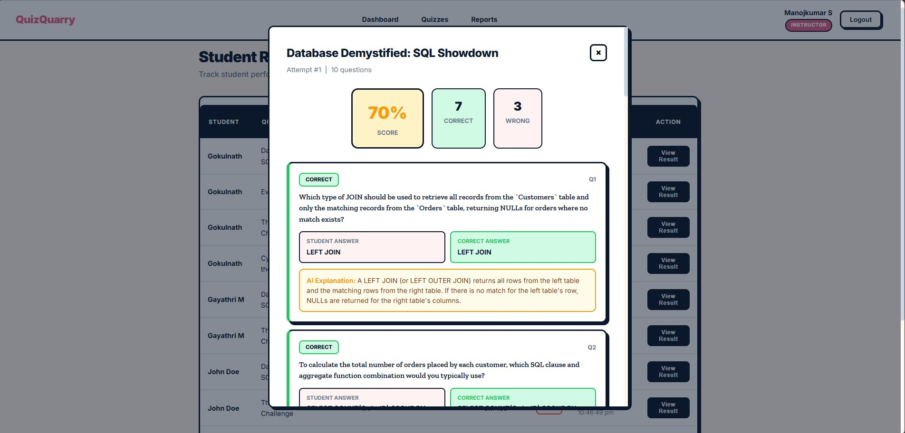<br/><sub><b>Instructor view — full question-by-question breakdown per student</b></sub></td>
  </tr>
</table>

---

## ✨ Features

### For Instructors
- **AI Question Generation** — Describe a concept and Gemini 2.5 Flash generates a full multiple-choice question bank instantly
- **Quiz Editor** — Review, edit, add, or delete individual AI-generated questions before publishing
- **Publish Controls** — Keep quizzes in draft until ready; publish as **Public** or **Private** (access-code-protected)
- **Configurable Rules** — Set per-question time limits, max attempts, and max allowed tab switches
- **Analytics Dashboard** — See submission counts per quiz, top performers, and overall class averages

### For Students
- **Test Protocol Screen** — Students see quiz rules, time limits, and tab-switch policy before starting
- **Proctored Attempt Flow** — One question at a time, auto-submit on timer expiry, tab-switch tracking
- **Instant Results** — Score, per-question correct/incorrect breakdown, and AI-written explanations
- **Attempt History** — Full log of every completed quiz with scores and timestamps
- **Global Leaderboard** — Ranked by average score across all quizzes, with personal rank highlighted

### Auth & Security
- **Email + OTP registration** — 6-digit OTP sent via SMTP, expires in 10 minutes
- **Google OAuth 2.0** — One-click sign-in; auto-created as a student account
- **JWT authentication** — Stateless, filter-based security on every protected route
- **Role-based access** — `INSTRUCTOR` and `STUDENT` roles enforced at both API and UI routing levels

---

## 🏗️ Tech Stack

| Layer | Technology |
|---|---|
| **Backend** | Java 17, Spring Boot 3.2, Spring Security, Spring Data JPA |
| **AI** | Google Gemini 2.5 Flash (`generativelanguage` REST API) |
| **Database** | MySQL 8 |
| **Auth** | JWT (jjwt 0.11), Google OAuth 2.0, BCrypt |
| **Email** | Spring Mail (Gmail SMTP / SSL) |
| **Frontend** | React 18, React Router v6, Redux Toolkit, Axios |
| **Build** | Maven (backend), Create React App (frontend) |

---

## 📁 Project Structure

```
QuizQuarry/
├── backend/
│   └── src/main/java/com/example/demo/
│       ├── config/          # SecurityConfig, DataSeeder
│       ├── controller/      # AuthController, QuizController, AttemptController
│       ├── dto/             # Request/Response DTOs
│       ├── entity/          # SystemUser, QuizAssessment, QuizQuestion, StudentAttempt, AttemptAnswer, OtpToken
│       ├── repository/      # Spring Data JPA repositories
│       ├── security/        # JwtService, JwtAuthenticationFilter
│       └── service/         # AuthService, QuizService, QuestionService (AI), AttemptGradingService, EmailService
└── frontend/
    └── src/
        ├── components/
        │   ├── attempt/     # AttemptForm, AttemptList, AttemptResult, StudentHistory, TestProtocol
        │   ├── dashboard/   # StatCards, DomainChart
        │   ├── quiz/        # QuizList, QuizForm, QuizEditor
        │   └── layout/      # Navbar
        ├── services/        # API service modules (axios)
        └── store/slices/    # Redux slices for auth, quiz, attempt, question
```

---

## 🚀 Getting Started

### Prerequisites
- Java 17+
- Maven 3.8+
- Node.js 18+ & npm
- MySQL 8
- A Google Cloud project with the **Generative Language API** enabled
- A Gmail account with an **App Password** for SMTP

### 1. Clone the repository

```bash
git clone https://github.com/your-username/quizquarry.git
cd quizquarry
```

### 2. Configure the backend

Open `backend/src/main/resources/application.properties` and fill in your values:

```properties
# Database
spring.datasource.url=jdbc:mysql://localhost:3306/quiz_quarry?createDatabaseIfNotExist=true
spring.datasource.username=<your-mysql-username>
spring.datasource.password=<your-mysql-password>

# Gemini AI
gemini.api.key=<your-gemini-api-key>

# Google OAuth
spring.security.oauth2.client.registration.google.client-id=<your-client-id>
spring.security.oauth2.client.registration.google.client-secret=<your-client-secret>

# Email (Gmail SMTP)
spring.mail.username=<your-gmail-address>
spring.mail.password=<your-16-char-app-password>
```

### 3. Run the backend

```bash
cd backend
mvn spring-boot:run
```

The API starts on **http://localhost:8080**.

### 4. Run the frontend

```bash
cd frontend
npm install
npm start
```

The app opens at **http://localhost:3000**.

---

## 🔑 Default Roles

| Role | Capabilities |
|---|---|
| `INSTRUCTOR` | Create & manage quizzes, view reports & analytics |
| `STUDENT` | Attempt published quizzes, view personal history & leaderboard |

Select your role during registration. Google OAuth accounts are automatically created as `STUDENT`.

---

## 🤖 How AI Generation Works

1. Instructor creates a quiz and enters **concepts** (e.g., `"Binary Search Trees"` or `"Photosynthesis"`)
2. The backend constructs a structured prompt and calls **Gemini 2.5 Flash**
3. Gemini returns a JSON array of questions — each with `question`, `options` (×4), `correctAnswer`, and `explanation`
4. Questions are saved to MySQL and shown in the Quiz Editor for instructor review
5. Instructor can edit, delete, or add more AI questions before publishing

---

## 🛡️ Proctoring Features

- **Per-question timer** — Configurable in seconds; auto-advances on expiry
- **Overall quiz timer** — Total time calculated from `questionTimeLimitSeconds × questionCount`
- **Tab-switch detection** — Browser visibility API tracks context switches; configurable max before lockout
- **Attempt limits** — Instructors set maximum retries per student
- **Access codes** — Private quizzes require a 6-digit code to start

---

## 📊 API Overview

| Endpoint | Method | Auth | Description |
|---|---|---|---|
| `/api/auth/register` | POST | Public | Register + send OTP |
| `/api/auth/verify-otp` | POST | Public | Verify OTP & create account |
| `/api/auth/login` | POST | Public | Email/password login → JWT |
| `/api/quizzes` | GET | Any | List available quizzes |
| `/api/quizzes` | POST | Instructor | Create quiz + generate questions |
| `/api/quizzes/{id}/publish` | POST | Instructor | Publish quiz |
| `/api/quizzes/{id}/questions` | GET | Instructor | List all questions for a quiz |
| `/api/attempts/start/{quizId}` | POST | Student | Start a new attempt |
| `/api/attempts/{id}/answer` | POST | Student | Submit answer for current question |
| `/api/attempts/{id}/submit` | POST | Student | Finalise attempt + get score |
| `/api/attempts/leaderboard` | GET | Any | Global leaderboard |
| `/api/attempts/report` | GET | Instructor | All student attempts report |

---

## 📄 License

This project is open source. Feel free to use, modify, and distribute.
